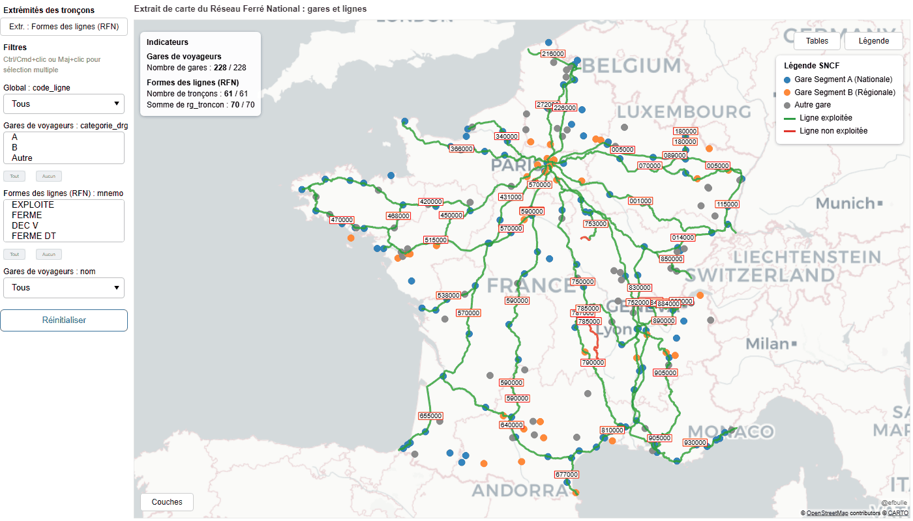

# `cartes_multicouches` — Référence API

Génération de cartes Bokeh interactives multi-couches (points, lignes) à partir
de `GeoDataFrame`, avec filtres, tables liées, indicateurs, annotations et
export CSV, le tout en HTML autonome.

## Sommaire

- [Installation & import](#installation--import)
- [Prise en main](#prise-en-main)
- [Illustrations](#illustrations)
- [`CarteDynMulti`](#cartedynmulti)
- [`LayerConfig`](#layerconfig)
- [`InteractionConfig`](#interactionconfig)
- [`StyleConfig`](#styleconfig)
- [`ColorMapping`](#styleconfig)
- [`AnnotationConfig`](#annotationconfig)
- [`LayerIndicator`](#layerindicator)
- [`MapConfig`](#mapconfig)
- [`GlobalDataConfig`](#globaldataconfig--filtres)
- [`LegendConfig` / `LegendEntry`](#legendconfig--legendentry)
- [`AttributionConfig`](#attributionconfig)
- [`carte_une_couche` — construction rapide](#carte_une_couche--construction-rapide)
- [Recettes](#recettes)
- [Tests](#tests)
- [Licence](#licence)

---

## Installation & import

Le paquet nécessite Python 3.13 ou supérieur. Depuis une copie locale du
dépôt, installez les dépendances avec :

```bash
uv sync
```

Pour contribuer au projet ou exécuter les tests, utilisez le groupe de
dépendances de développement :

```bash
uv sync --group dev
uv run playwright install chromium
uv run pre-commit install --install-hooks
uv run pytest
```

```python
from cartes_multicouches import (
    CarteDynMulti,
    LayerConfig,
    LayerIndicator,
    StyleConfig,
    ColorMapping,
    MapConfig,
    GlobalDataConfig,
    AnnotationConfig,
    AttributionConfig,
    LegendConfig,
    LegendEntry,
    carte_une_couche,
)
```

Tout ce qui est déclaré public dans `cartes_multicouches/dynamic.py` et
`cartes_multicouches/_helpers.py` est réexporté explicitement au niveau du
package (`__init__.py`), donc un seul point d'import suffit — pas besoin de
descendre dans les sous-modules.

---

## Prise en main

```python
import geopandas as gpd
from shapely.geometry import Point
from cartes_multicouches import CarteDynMulti, LayerConfig, StyleConfig, ColorMapping, MapConfig

points = gpd.GeoDataFrame(
    {"name": ["A", "B", "C"], "category": ["ville", "gare", "ville"]},
    geometry=[Point(2.35, 48.85), Point(2.37, 48.86), Point(2.33, 48.84)],
    crs="EPSG:4326",
)

layers = [
    LayerConfig(
        name="Points d'intérêt",
        data=points,
        style=StyleConfig(
            color=ColorMapping(column="category", mapping={"ville": "#1f77b4", "gare": "#ff7f0e"})
        ),
        tooltips=[("Nom", "@name"), ("Catégorie", "@category")],
    ),
]

carte = CarteDynMulti(layers, map_config=MapConfig(title="Ma carte"))
carte.save("carte.html")
```

Points clés :

- Les géométries doivent être `Point`, `LineString` ou `MultiLineString`
  (les polygones ne sont pas supportés).
- Le CRS d'entrée est libre ; les données sont reprojetées en `EPSG:3857`
  (Web Mercator) en interne pour l'affichage sur fond de carte.
- `carte.save(filepath)` produit un fichier HTML autonome (ressources
  chargées depuis le CDN Bokeh).

---

## Illustrations
Ces captures utilisent des données de l'[Open Data SNCF](https://ressources.data.sncf.com/pages/accueil/).




---

## `CarteDynMulti`

Classe principale, orchestre la construction de la figure, des couches et du
layout.

```python
CarteDynMulti(
    layers_config: list[LayerConfig],
    map_config: MapConfig | None = None,
    data_config: GlobalDataConfig | None = None,
    legend_config: LegendConfig | None = None,
    attribution_config: AttributionConfig | None = None,
)
```

| Paramètre | Type | Description |
|---|---|---|
| `layers_config` | `list[LayerConfig]` | Une couche par entrée. Les noms doivent être uniques (sinon `ValueError`). |
| `map_config` | `MapConfig \| None` | Paramètres de la figure et du layout. |
| `data_config` | `GlobalDataConfig \| None` | Filtres globaux/spécifiques par couche. |
| `legend_config` | `LegendConfig \| None` | Légende déclarative, indépendante des couches. |
| `attribution_config` | `AttributionConfig \| None` | Signature affichée en bas à droite de la carte. |

### `save(filepath: str | Path, zip: bool = False, resources: Resources | ResourcesMode = CDN) -> None`

Écrit la carte (figure + panneaux + JS embarqué) dans un fichier HTML
autonome.

- `filepath` : Chemin du fichier HTML de sortie.
- `zip` : Si `True`, génère également une archive `.zip` contenant le fichier HTML.
- `resources` : Mode d'inclusion des ressources Bokeh (`CDN` par défaut).

```python
carte.save("output/carte.html")
```

### Attributs utiles après construction

| Attribut | Type | Contenu |
|---|---|---|
| `carte.fig` | `bokeh.plotting.figure` | La figure Bokeh sous-jacente. |
| `carte.layers` | `dict[str, LayerState]` | État interne par couche (source, filtre, renderers). |
| `carte.layout_widget` | `bokeh.models.Row` | Layout complet (panneau gauche + carte + tables). |

---

## `LayerConfig`

Une couche = une géométrie stylée, avec ses filtres, tooltips, indicateurs et
annotations optionnels.

```python
@dataclass
class LayerConfig:
    name: str
    data: gpd.GeoDataFrame
    style: StyleConfig = StyleConfig()
    tooltips: list[tuple[str, str]] | None = None
    columns_to_show: list[str] | None = None
    indicators: list[LayerIndicator] | None = None
    annotation: AnnotationConfig | None = None
    interaction: InteractionConfig = InteractionConfig()
    visible_by_default: bool = True
    has_table: bool = True
    show_endpoints: bool = False
```

| Champ | Description |
|---|---|
| `name` | Identifiant unique de la couche (utilisé dans les toggles, tables, exports). |
| `data` | `GeoDataFrame` source. Copié et reprojeté en interne, jamais muté. |
| `style` | Voir [`StyleConfig`](#styleconfig). |
| `tooltips` | Paires `(libellé, "@champ")` façon Bokeh. Si `None`, les 6 premières colonnes affichables sont utilisées automatiquement. |
| `columns_to_show` | Colonnes affichées dans la table liée (par défaut : toutes sauf `geometry` et les colonnes internes). |
| `indicators` | Liste d'agrégats affichés en overlay (compte, somme). Voir [`LayerIndicator`](#layerindicator). |
| `annotation` | Étiquettes textuelles sur la couche. Voir [`AnnotationConfig`](#annotationconfig). |
| `interaction` | Contrôle des interactions par couche. Voir [`InteractionConfig`](#interactionconfig). |
| `visible_by_default` | Visibilité initiale de la couche. |
| `has_table` | Génère (ou non) un onglet de table de données liée à la couche. |
| `show_endpoints` | Pour les lignes : ajoute un toggle affichant les points de début/fin de chaque tronçon. |

---

## `InteractionConfig`

Contrôle fin des interactions Bokeh par couche, utile pour désactiver les
hover/tooltips/clics sur certaines géométries sans impacter les autres couches.

```python
@dataclass
class InteractionConfig:
    hover: bool = True
    tooltips: bool = True
    tap: bool = True
```

| Champ | Description |
|---|---|
| `hover` | Active ou non le `HoverTool` de la couche. |
| `tooltips` | Si `False`, le `HoverTool` est créé mais sans tooltip (ou avec une liste vide), ce qui supprime l’affichage des infos-bulles. |
| `tap` | Active ou non le `TapTool` de la couche. |

Exemple :

```python
LayerConfig(
    name="Villes",
    data=gdf,
    interaction=InteractionConfig(hover=False, tooltips=False, tap=False),
)
```

---

## `StyleConfig`

```python
@dataclass
class StyleConfig:
    color: str | ColorMapping | None = "navy"
    missing_color: str = "gray"
    size_or_width: int | float | str = 3
    alpha: float = 0.8
    nonselection_alpha: float = 0.15
    marker: str = "circle"
    line_dash: str = "solid"
    hover_mode: Literal["mouse", "hline", "vline"] = "mouse"
    endpoint_color: str = "#111111"
    endpoint_size: int | float = 8
```

`color` accepte quatre formes :

1. **Couleur fixe** : `color="navy"`.
2. **Nom de colonne catégorielle** : `color="status"` — une palette
   (`Category10`/`Category20` selon le nombre de valeurs distinctes) est
    générée et appliquée automatiquement via un `CategoricalColorMapper`. Cas
    particulier : si toutes les valeurs non nulles de la colonne sont des
    couleurs reconnues (par exemple `"red"` et `"#ff0000"`), elles sont
    utilisées directement comme couleurs Bokeh, sans palette catégorielle. Si
    la colonne contient un mélange de valeurs reconnues comme couleurs et de
    valeurs qui ne le sont pas, un `UserWarning` est émis (signale
    probablement une faute de frappe) et la colonne entière est traitée en
    mode catégoriel.
3. **Mapping explicite valeur → couleur** :
   `color=ColorMapping(column="status", mapping={"ouverte": "#2ca02c", "fermée": "#d62728"})`
   — les valeurs absentes du mapping utilisent `missing_color`.
4. **`None`** : pas de couleur dérivée des données, `missing_color` est
   appliqué uniformément à toute la couche.

```python
@dataclass(frozen=True)
class ColorMapping:
    column: str
    mapping: dict[str, str]
```

| Champ | Description |
|---|---|
| `column` | Colonne du `GeoDataFrame` dont les valeurs sont converties en couleur. |
| `mapping` | `{valeur: couleur}`. Toute valeur de `column` absente de ce dict retombe sur `StyleConfig.missing_color`. |

`size_or_width` contrôle la taille des marqueurs (`Point`) ou l'épaisseur
des lignes (`LineString`/`MultiLineString`) ; accepte aussi un nom de
colonne pour une taille/épaisseur variable par ligne (mécanisme Bokeh
`NumberSpec`, voir [Recettes](#offset-dannotation-par-étiquette) pour le
même principe appliqué aux offsets).

---

## `AnnotationConfig`

Étiquettes textuelles positionnées sur une couche (`bokeh.models.Text`).

```python
@dataclass
class AnnotationConfig:
    text: str
    x: str = COL_ANN_X
    y: str = COL_ANN_Y
    x_offset: int | float | str = 0
    y_offset: int | float | str = 0
    text_align: Literal["left", "center", "right"] = "center"
    text_font_size: str = "12px"
    text_color: str = "black"
    background_fill_color: str | None = "white"
    border_line_color: str | None = "red"
    padding: int = 2
    text_args: dict[str, Any] = field(default_factory=dict)
    subset_column: str | None = None
```

| Champ | Description |
|---|---|
| `text` | Nom de la colonne contenant le texte à afficher (obligatoire). |
| `x`, `y` | Nom de colonne pour la position de l'étiquette. Par défaut : point pour les couches `Point`, point milieu du tracé pour les lignes (calculé automatiquement, colonnes internes `COL_ANN_X`/`COL_ANN_Y`). |
| `x_offset`, `y_offset` | **Nombre** → offset identique pour toute la couche. **Nom de colonne** → offset différent par étiquette. Toujours en pixels écran (stable quel que soit le zoom). |
| `text_align`, `text_font_size`, `text_color` | Style du texte. |
| `background_fill_color`, `border_line_color` | Fond et bordure de l'étiquette ; `None` pour désactiver. |
| `padding` | Marge interne de la boîte d'étiquette, en pixels. |
| `text_args` | Kwargs supplémentaires passés tels quels au glyph `Text` de Bokeh (prioritaires sur les champs ci-dessus). Les retours à la ligne dans les valeurs de texte sont pris en charge, par exemple via `"Clermont\nFerrand"`. |
| `subset_column` | Nom d'une colonne booléenne du `GeoDataFrame`. Si renseigné, seules les lignes où cette colonne vaut `True` sont annotées (sous-ensemble statique). |

Une couche avec annotation ajoute automatiquement un toggle "Annotations"
dans le panneau gauche, couplé à la visibilité de la couche elle-même.

---

## `LayerIndicator`

Agrégat affiché dans l'overlay "Indicateurs" en haut de la carte.

```python
@dataclass(frozen=True)
class LayerIndicator:
    label: str
    kind: Literal["count", "sum"]
    column: str | None = None
```

- `kind="count"` : nombre de lignes de la couche (pas besoin de `column`).
- `kind="sum"` : somme d'une colonne numérique — `column` obligatoire, sinon
  `ValueError` à la construction.

---

## `MapConfig`

```python
@dataclass
class MapConfig:
    title: str = "Carte Dynamique Multi-couches"
    height: int = 650
    width: int | None = None
    tile_provider: str = "CartoDB.Positron"
    left_panel_width: int | None = None
    tables_panel_width: int = 320
    toolbar_location: Literal["above", "below", "left", "right"] | None = "above"
    legend_position: Literal["top-right", "top-left", "bottom-right", "bottom-left"] = "top-right"
```

- `width=None` (par défaut) → la figure s'étire pour remplir l'espace
disponible (`sizing_mode="stretch_both"`). Fixer `width` bascule en taille
fixe.
- `left_panel_width=None` → largeur calculée automatiquement à partir des
titres de filtres et de leurs options (entre 180 et 360 px).
- `tile_provider` : tout fournisseur Bokeh ou xyzservices valide (`CartoDB.Positron`,
  `OSM`, `EsriGrayCanvas`, …).

---

## `GlobalDataConfig` — filtres

Déclare les colonnes filtrables, séparément des couches elles-mêmes.

```python
@dataclass
class GlobalDataConfig:
    global_filters: list[str] = field(default_factory=list)
    global_select_filters: list[str] = field(default_factory=list)
    specific_filters: dict[str, list[str]] = field(default_factory=dict)
    specific_select_filters: dict[str, list[str]] = field(default_factory=dict)
    multi_select_size: int = 4
    global_filters_order: dict[str, list[str]] = field(default_factory=dict)
    global_select_filters_order: dict[str, list[str]] = field(default_factory=dict)
    specific_filters_order: dict[str, dict[str, list[str]]] = field(default_factory=dict)
    specific_select_filters_order: dict[str, dict[str, list[str]]] = field(default_factory=dict)
```

| Champ | Widget | Portée |
|---|---|---|
| `global_filters` | `MultiSelect` | Colonne agrégée sur **toutes** les couches qui la possèdent. |
| `global_select_filters` | `Select` (choix unique + "Tous") | Idem, sélection unique. |
| `specific_filters` | `MultiSelect` | `{nom_de_couche: [colonnes]}` — propre à une couche. |
| `specific_select_filters` | `Select` | Idem, sélection unique. |
| `multi_select_size` | — | Hauteur des `MultiSelect` en nombre d'éléments visibles. La valeur est automatiquement réduite si la liste d'options est plus courte. |
| `*_order` | — | Ordre explicite des options (sinon tri alphabétique). Les valeurs présentes dans les données mais absentes de l'ordre explicite sont ajoutées à la suite, triées. |

Les filtres sont appliqués côté client (CustomJS), sans round-trip serveur.

---

## `LegendConfig` / `LegendEntry`

Légende déclarative, découplée des couches réelles (permet de regrouper ou
renommer librement leurs valeurs).

```python
@dataclass
class LegendEntry:
    label: str
    color: str
    shape: Literal["point", "line"] = "point"
    marker: str = "circle"
    size: float = 10


@dataclass
class LegendConfig:
    title: str = "Légende"
    entries: list[LegendEntry] = field(default_factory=list)
    visible_by_default: bool = True
    width: int | None = None
```

- `width` : Largeur (px) de la fenêtre de légende (`None` = largeur automatique, 200px max).

`marker` accepte les mêmes valeurs que `StyleConfig.marker` (`circle`,
`square`, `diamond`, `triangle`, `inverted_triangle`, `hex`, `cross`, `x`,
`asterisk`, `star`) ; un rendu SVG local est généré pour chaque puce (pas de
dépendance à un rendu Bokeh caché).

> Rien ne lie automatiquement une `LegendEntry` à la couleur réelle d'une
> couche : à toi de garder les deux cohérents (voir `example.py`, qui
> centralise les couleurs dans des constantes partagées).

---

## `AttributionConfig`

```python
@dataclass
class AttributionConfig:
    text: str = "@efbulle"
    href: str = "https://github.com/efbulle"
```

Petite signature en bas à droite de la carte, cliquable.

Sans `attribution_config` explicite, la bibliothèque charge aussi les préférences
personnelles dans `%APPDATA%/cartes_multicouches/config.toml`. Si ce fichier est
absent, les valeurs par défaut ci-dessus restent utilisées. Crée-le ainsi :

```toml
[attribution]
text = "Mon nom"
href = "https://example.com"
```

Une `AttributionConfig` passée au constructeur de `CarteDynMulti` est prioritaire
sur ce fichier. Les futures préférences pourront être ajoutées dans ce même fichier.

Pour afficher une adresse électronique, utilise simplement un lien `mailto:` :

```python
attribution_config = AttributionConfig(text="myname", href="mailto:user@example.com")
```

---

## `carte_une_couche` — construction rapide

Raccourci pour le cas le plus fréquent : une seule couche, un ou deux
filtres, une légende basique. N'introduit aucun nouveau concept : chaque
paramètre correspond directement à un champ des dataclasses ci-dessus
(`LayerConfig`, `StyleConfig`, `MapConfig`, `GlobalDataConfig`) et lui est
transmis sans transformation ni valeur dérivée.

```python
def carte_une_couche(
    gdf: gpd.GeoDataFrame,
    *,
    name: str = "Tronçons",
    tooltips: list[tuple[str, str]] | None = None,
    columns_to_show: list[str] | None = None,
    interaction: InteractionConfig | None = None,
    color: str | ColorMapping | None = "navy",
    alpha: float = 0.8,
    size_or_width: int | float | str = 3,
    title: str = "Carte",
    height: int = 650,
    width: int | None = None,
    filters: list[str] | None = None,
    multi_select_size: int = 4,
    legend_config: LegendConfig | None = None,
) -> CarteDynMulti
```

| Paramètre | Correspond à |
|---|---|
| `name`, `tooltips`, `columns_to_show`, `interaction` | Champs `LayerConfig` de même nom. |
| `color`, `alpha`, `size_or_width` | Champs `StyleConfig` de même nom. |
| `title`, `height`, `width` | Champs `MapConfig` de même nom. |
| `filters` | Liste de colonnes → `GlobalDataConfig.specific_filters={name: filters}`. La clé du dict est forcément `name` puisqu'il n'y a qu'une couche, donc pas besoin de la répéter. |
| `multi_select_size` | Hauteur des `MultiSelect` en nombre d'éléments visibles. La valeur est automatiquement réduite si les options sont moins nombreuses. |
| `legend_config` | Transmis tel quel à `CarteDynMulti` ; aucune légende n'est déduite automatiquement de `color` — à construire explicitement si besoin (voir [`LegendConfig`](#legendconfig--legendentry)). |

Pour tout paramètre non exposé ici (`missing_color`, `indicators`,
`annotation`, `show_endpoints`, `global_filters`, `*_order`,
`attribution_config`, etc.), construire les dataclasses à la main et appeler
`CarteDynMulti` directement — `carte_une_couche` ne couvre que le cas simple.

```python
from cartes_multicouches import carte_une_couche, ColorMapping, LegendConfig, LegendEntry

carte = carte_une_couche(
    gdf,
    name="Réseau régional",
    color=ColorMapping(column="mnemo", mapping={"TER": "#1f77b4", "FRET": "#d62728"}),
    filters=["mnemo", "code_ligne"],
    legend_config=LegendConfig(
        entries=[
            LegendEntry(label="TER", color="#1f77b4", shape="line"),
            LegendEntry(label="FRET", color="#d62728", shape="line"),
        ],
    ),
)
carte.save("reseau.html")
```

---

## Recettes

### Couche de lignes avec extrémités affichables

```python
LayerConfig(
    name="Tronçons",
    data=lines_gdf,
    style=StyleConfig(color="status", size_or_width=3),
    show_endpoints=True,  # ajoute un toggle "Extr. : Tronçons"
)
```

### Indicateurs agrégés

```python
LayerConfig(
    name="Gares",
    data=gares_gdf,
    indicators=[
        LayerIndicator(label="Nombre de gares", kind="count"),
        LayerIndicator(label="Voyageurs/an", kind="sum", column="voyageurs"),
    ],
)
```

### Filtres globaux et spécifiques

```python
data_config = GlobalDataConfig(
    global_select_filters=["line_no"],
    global_select_filters_order={"line_no": ["1", "2", "3"]},
    global_filters=["status"],
    specific_filters={"Points d'intérêt": ["category"]},
)
```

### Désactiver les interactions d’une couche

```python
LayerConfig(
    name="Villes",
    data=gdf,
    interaction=InteractionConfig(hover=False, tooltips=False, tap=False),
)
```

### Offset d'annotation par étiquette

Un nombre s'applique uniformément ; un **nom de colonne** permet un offset
différent par étiquette (par ex. pour désencombrer des libellés qui se
chevauchent) :

```python
gdf["label_dy"] = [0, -14, 14, 0]  # calculé en amont, en pixels

LayerConfig(
    name="Gares",
    data=gdf,
    annotation=AnnotationConfig(text="nom", y_offset="label_dy"),
)
```

### Annotation multi-ligne

```python
LayerConfig(
    name="Villes",
    data=gdf,
    annotation=AnnotationConfig(
        text="name",
        text_font_size="10px",
        text_args={"text_line_height": 1.1},
    ),
)
```

Les valeurs de texte contenant `\n` sont rendues sur plusieurs lignes.

### Carte complète (filtres + légende + indicateurs)

```python
carte = CarteDynMulti(
    layers_config=[layer_points, layer_lignes],
    map_config=MapConfig(title="Réseau", height=700, left_panel_width=200),
    data_config=data_config,
    legend_config=legend_config,
    attribution_config=AttributionConfig(text="@moncompte"),
)
carte.save("reseau.html")
```

---

## Tests

Tests de fumée : pas de couverture exhaustive, juste la vérification
qu'une carte réelle se charge dans un navigateur sans erreur JavaScript,
sur plusieurs chemins de construction (couche unique, multi-couches,
config minimale, `color` fixe vs catégoriel). Suffisant pour attraper la
casse la plus grave — un `CustomJS` mal formé qui empêche tout rendu —
sans demander de maintenir une suite plus lourde.

### Dépendances de développement

Les dépendances sont déclarées dans le groupe `dev` de `pyproject.toml`.

```bash
uv sync --group dev
uv run playwright install chromium   # binaire du navigateur, installé séparément
uv run pre-commit install --install-hooks
```

Les hooks Ruff s'exécutent à chaque commit. Le hook `pre-push` exécute la
suite de tests complète. Pour lancer tous les contrôles manuellement :

```bash
uv run pre-commit run --all-files
uv run pre-commit run pytest --hook-stage pre-push --all-files
```

### Lancer

```bash
uv run pytest -v
```

### Fichiers

- `tests/test_smoke.py` — les tests de fumée eux-mêmes.

Pas de fixtures séparées : chaque test construit sa propre carte à partir
de données synthétiques minuscules définies en tête de fichier, pour que
le scénario testé reste lisible dans le test lui-même.

---

## Statut du projet

Ce dépôt est actuellement un projet vitrine.

Le code est public à des fins de démonstration et de partage, mais il n'existe pas, à ce stade, de processus formel de contribution externe.

---

## Licence

Ce projet est distribué sous licence MIT. Voir [LICENSE](LICENSE).
